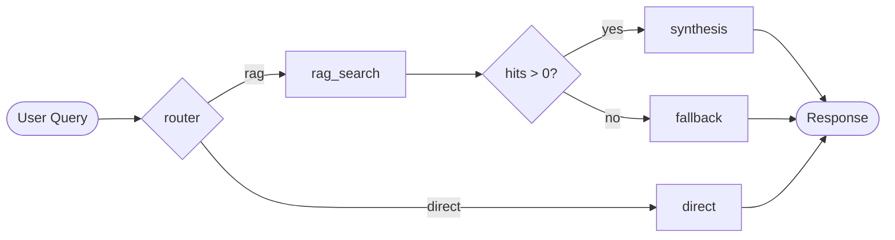

# Agentic Edge Stack

A locally hosted, CPU-only AI assistant that demonstrates model
serving, RAG, agentic orchestration, and streaming APIs in a single
FastAPI app.

## Architecture

Layered FastAPI layout. Each package is single-responsibility, and each
subpackage exposes a `types.py` (dataclasses) and `errors.py` (domain
exceptions) so failure modes never leak across layers.

```
app/
├── core/      # Pydantic Settings (cross-cutting config)
├── llm/       # Ollama client                                 (Part 1)
├── rag/       # FAISS + BGE pipeline                          (Part 2)
│              #   chunker, embeddings, vector_store,
│              #   retriever, prompt_builder
├── agent/     # LangGraph state machine                       (Part 3)
│              #   prompts, tools, nodes, graph, runner
└── api/       # FastAPI + SSE streaming                       (Part 4)
               #   main, routes, schemas, sse
```

## Requirements

- Python 3.10+
- [Ollama](https://ollama.com/download) for local inference

Defaults: `llama3.2:1b` (Q4_K_M, ~770 MB) and
`BAAI/bge-small-en-v1.5` (33M params, 384-dim) - both chosen for
CPU-only edge hardware. See
[`data/01_llama32_model_card.md`](data/01_llama32_model_card.md) and
[`data/03_sentence_transformers_and_bge.md`](data/03_sentence_transformers_and_bge.md)
for the rationale.

## Quick Start

### 1. One-shot launch

```powershell
git clone <your-repo-url>
cd agentic-edge-stack
.\scripts\start.ps1
```

`deploy.ps1` automatically copies `.env.example` to `.env` on the first
run if `.env` is missing.

`start.ps1` orchestrates the existing setup scripts in three stages:

1. **`deploy.ps1`** - creates `venv/`, installs Python deps, pulls the
   Ollama LLM (`llama3.2:1b`).
2. **`import_embed_model.ps1`** - downloads `BAAI/bge-small-en-v1.5`
   (~134 MB, skipped if already present).
3. **`run_api.ps1`** - activates `venv/`, probes Ollama, launches
   uvicorn on `http://0.0.0.0:8000`.

Wait for `Application startup complete` (cold ~5 s, warm cache ~1 s).

Common flags:

```powershell
.\scripts\start.ps1 -SkipDeploy -SkipEmbedModel    # fast restart, deps unchanged
.\scripts\start.ps1 -Port 9000 -Reload             # dev mode, hot reload
```

### 2. Manual setup (advanced / offline)

The underlying scripts can each be invoked on their own - useful for
offline GGUF import, selective re-runs, or debugging:

```powershell
.\scripts\deploy.ps1                  # venv + deps + ollama pull
.\scripts\import_model.ps1            # offline: drop GGUF in Downloads first
.\scripts\import_embed_model.ps1      # embedding model, ~134 MB
.\scripts\run_api.ps1                 # API only
```

The offline LLM path uses the project's [`Modelfile`](Modelfile), which
embeds Meta's official Llama 3.2 chat template and stop tokens, so the
imported model behaves identically to one fetched via `ollama pull`.

### 3. Verify

In a second terminal (the API server keeps running):

```powershell
python tests\verify_ollama.py        # Part 1 - "Hello World"
python tests\verify_rag.py           # Part 2 - 6 demo queries (5 in-domain + 1 OOD)
python tests\verify_agent.py         # Part 3 - 7 queries exercising every graph edge
python tests\verify_api.py           # Part 4 - 4 streamed /chat queries
```

Each verifier writes a trace log under `tests/logs/` (committed to git -
the logs are part of the deliverable). Each trace shows, per query, the
retrieved chunks with cosine scores, the augmented prompt, the routing
decision, and per-step latency. Pass `--skip-llm` to `verify_rag.py`
for retrieval-only runs.

`verify_api.py` records **time-to-first-token (TTFT)** alongside total
latency - the gap is the user-visible value of streaming.

Manual smoke test:

```bash
curl -N -X POST http://127.0.0.1:8000/chat \
     -H "Content-Type: application/json" \
     -H "Accept: text/event-stream" \
     -d '{"query": "Translate good morning to Spanish."}'
```

OpenAPI docs: [`/docs`](http://127.0.0.1:8000/docs). Note: Swagger UI
buffers SSE and only renders responses after the connection closes -
use `verify_api.py` or `curl -N` to see tokens stream live.

## Configuration

| Variable | Meaning | Default |
|----------|---------|---------|
| `OLLAMA_HOST` | Ollama base URL | `http://localhost:11434` |
| `OLLAMA_MODEL` | Ollama model tag | `llama3.2:1b` |
| `REQUEST_TIMEOUT` | HTTP timeout (seconds) | `120` |
| `EMBED_MODEL_NAME` | HF id or local path | `./models/bge-small-en-v1.5` |
| `EMBED_DIM` | Embedding dimensionality | `384` |
| `RAG_CHUNK_SIZE` / `RAG_CHUNK_OVERLAP` | Chunking | `500` / `50` |
| `RAG_TOP_K` / `RAG_SCORE_THRESHOLD` | Retrieval | `3` / `0.5` |
| `DATA_DIR` / `CACHE_DIR` | Corpus / on-disk vectors | `data` / `data/cache` |
| `API_HOST` / `API_PORT` | FastAPI bind | `0.0.0.0` / `8000` |
| `API_CORS_ORIGINS` | CORS allow-list (JSON) | `["*"]` |
| `SSE_KEEPALIVE_SECONDS` | Idle-proxy ping interval | `15` |

Full template: [`.env.example`](.env.example).

## Agent design notes

The agent is a small **LangGraph** state machine - the modern
replacement for the deprecated `langchain.AgentExecutor`. Five nodes,
two conditional edges, and the diagram below is generated by
`get_graph().draw_mermaid()` on the compiled graph, so it never drifts
from the code.



`AgentExecutor` was deprecated in LangChain 0.3 and relies on
OpenAI-style native function calling, which `llama3.2:1b` does not
produce reliably. LangGraph keeps the state machine explicit and
typeable (`AgentState` is a `TypedDict` with `Annotated[list, add]`
reducers).

### Deterministic LLM router

A 1B classifier is unreliable at binary tasks - in early runs the
router routed *every* query to RAG. The fix is three coordinated
changes in [`app/agent/nodes.py`](app/agent/nodes.py) and
[`app/agent/prompts.py`](app/agent/prompts.py):

1. **Sampling.** `options={"temperature": 0, "num_predict": 5}` -
   greedy decoding, capped output (the model can't ramble into a
   paragraph that confuses the parser).
2. **Parser default.** `parse_route` returns `"direct"` on ambiguity.
   The asymmetry is intentional: a wrong `"direct"` produces a generic
   but often useful answer; a wrong `"rag"` returns the canonical
   "I don't have that information" fallback whenever the question is
   unrelated to the knowledge base, which is strictly worse for the
   user.
3. **Few-shot balance.** 5 DIRECT examples first (primacy bias) vs.
   3 RAG examples - counter-weighting the 1B model's tendency to favour
   the more "specialised" looking label.

Every query is evaluated by the LLM (`method=llm` in the trace) - no
heuristic shortcuts.

### LLM-free fallback

When the router picks RAG but retrieval returns zero chunks above the
score threshold, `fallback_node` returns the canonical *"I don't have
that information in my knowledge base."* string **without** calling the
LLM, saving 5-7 s per dead-end query.

### Tool definition

`rag_search` uses `@tool` from `langchain-core` with a Pydantic
`args_schema`. The function docstring *is* the description an
LLM-driven router sees, so it explicitly enumerates the topics the
knowledge base covers and the topics it does not.

```python
@tool("rag_search", args_schema=RagSearchInput)
def rag_search(query: str) -> RetrievalResult:
    """Search the local technical knowledge base for facts about the
    deployed Llama 3.2 model, the RAG pipeline (FAISS IndexFlatIP),
    BGE-small embeddings, the Ollama runtime, or this project's chunking
    strategy. ..."""
```

## Streaming API design notes

Part 4 wraps the agent in a single-endpoint FastAPI service that
streams the response token-by-token over SSE. Goals: production-
readiness (lifespan singletons, validation, CORS, keepalive, structured
errors) and zero duplication of agent logic - the graph stays the
single source of truth.

**Why SSE, not WebSockets.** The interaction is strictly server-to-
client text streaming with one request body up front. SSE works over
plain HTTP/1.1, has built-in reconnection, is trivial to consume with
`curl`, and survives most corporate proxies. WebSockets adds
bi-directional framing complexity this use case never needs.

**Streaming via LangGraph's custom channel.** `synthesis_node` and
`direct_node` call
[`get_stream_writer()`](https://langchain-ai.github.io/langgraph/reference/runtimes/#langgraph.config.get_stream_writer)
and emit per-token events. The writer is a no-op when the graph runs
synchronously (`AgentRunner.run`) and a real conduit when invoked
through `graph.stream(stream_mode=["updates","custom"])`. The same node
code therefore powers both the Part 3 batch trace artefact and the
Part 4 SSE endpoint.

```python
# app/agent/nodes.py (excerpt)
writer = get_stream_writer()
for token in llm.generate_stream(prompt):
    chunks.append(token)
    writer({"type": "token", "node": "synthesis", "value": token})
```

**Rich event protocol.** `POST /chat` emits five event types defined in
[`app/api/sse.py`](app/api/sse.py):

| `event:` | When |
|----------|------|
| `route` | Router decision (`{route, method, elapsed_ms}`) |
| `tool_call` | After `rag_search` runs (`{name, hits, top_score, ...}`) |
| `token` | Once per LLM token (`{node, value, elapsed_ms}`) |
| `done` | Full `AgentResponse`-shaped trace + `total_elapsed_ms` |
| `error` | Replaces `done` if a layer raises |

The closing `done` event carries the same trace structure that
`format_trace_json` produces in Part 3, so a single HTTP round-trip
delivers both the streaming UX *and* a complete audit log.

**Sync I/O bridged to async.** `OllamaClient.generate_stream` uses
blocking `requests` I/O. The handler wraps the synchronous SSE
generator in
[`starlette.concurrency.iterate_in_threadpool`](https://www.starlette.io/concurrency/),
keeping the uvicorn event loop free for keepalive pings and
client-disconnect detection.
[`sse-starlette`](https://github.com/sysid/sse-starlette)'s
`EventSourceResponse` handles keepalive comments automatically (every
`SSE_KEEPALIVE_SECONDS`).

**Lifespan singleton.** `AgentRunner` is built exactly once in the
FastAPI lifespan: BGE loads (~150 MB to RAM), FAISS ingests or restores
from `data/cache/` *before* the server accepts traffic. Concurrent
`/chat` calls share the same retriever (read-only after ingest) and the
same compiled graph, so each costs only one extra in-flight LLM stream.
`/health` returns `status: ok` only once init completes - aligned with
the Kubernetes readiness-probe contract.

## RAG design notes

- **Embedding model.** BGE-small-en-v1.5 (~33M, 384-dim) over
  `all-MiniLM-L6-v2` (22M, 384-dim) - BGE scores ~6 points higher on
  MTEB at the same inference cost.
- **Vector store.** FAISS `IndexFlatIP` (exact brute-force) with
  L2-normalized vectors, so inner product = cosine similarity. At
  ~50-200 chunks the corpus is too small for IVF/HNSW.
- **Chunking.** `RecursiveCharacterTextSplitter` with markdown-aware
  separators (`\n## `, `\n### `, ...). 500 chars / 50 overlap.
- **Cache.** Vectors persist to `data/cache/`; manifest keyed on a
  SHA-256 of the corpus + embed model name + dim - any edit invalidates
  the cache automatically.
- **Score threshold (0.5)** filters weak hits, surfacing out-of-domain
  queries as zero-hit retrievals routed to the canonical fallback.

## Project Status

- [x] **Part 1 - Model serving.** Ollama + Llama 3.2 1B Q4_K_M via Modelfile import.
- [x] **Part 2 - In-Memory RAG.** FAISS over BGE embeddings, on-disk cache, per-query trace logs.
- [x] **Part 3 - Agentic Orchestrator.** LangGraph state machine, deterministic LLM router, dual text/JSON traces.
- [x] **Part 4 - Streaming API.** FastAPI + SSE with rich events, lifespan singleton, end-to-end TTFT artefact.
- [ ] Part 5 - Bonus tasks (quantization profiling, structured output).

## Possible extensions

- **Conversation memory.** `/chat` is currently stateless - each
  request carries only the latest `query`. Extending `ChatRequest` with
  a `messages` list and threading it into `direct` / `synthesis`
  prompts would enable multi-turn context with no graph changes.

## License

MIT
